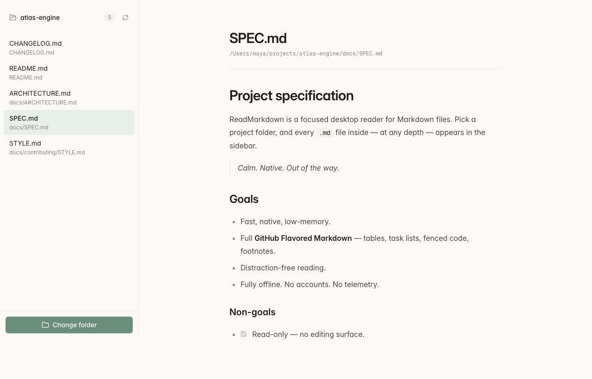

<div align="center">
  

  <h1>ReadMarkdown</h1>

  <p>
    Read every <code>.md</code> file in a folder, recursively.<br/>
    A focused, native macOS reader that ignores everything else.
  </p>

  <p>
    <a href="https://github.com/mukul13/readmarkdown/releases/latest">
      
    </a>
    
    
    
  </p>
</div>

<p align="center">
  
</p>

---

## What it is

ReadMarkdown is a small, native macOS app for reading the Markdown scattered through a project. Pick a folder, and every `.md` / `.markdown` file inside — at any depth — appears in a clean sidebar. Click one, read it. That is the whole product.

It deliberately does **not** edit files, search across files, or watch the disk. It is a reader.

## Features

- **Recursive scan** — walks every nested directory under the folder you pick.
- **`.md` only** — non-Markdown files are ignored entirely. Sensible skip list for `node_modules`, `.git`, `target`, `dist`, `build`, `.next`, `.turbo`, `.cache`, `.vscode`, `.idea`, plus all dotdirs.
- **Full-text search** — type in the sidebar to filter by filename or by content. Matched files show a snippet of the hit.
- **Full GFM** — tables, task lists, fenced code with syntax highlighting, footnotes, autolinks.
- **Refresh button** — re-scan the folder and re-read the current file (catches edits made elsewhere).
- **Native, calm UI** — paper-warm light theme, automatic dark mode, generous reading width.
- **Tiny** — 3.2 MB DMG, ~8.7 MB installed, low idle memory.
- **Offline. No accounts. No telemetry.**

## Download

Grab the latest DMG from **[Releases](https://github.com/mukul13/readmarkdown/releases/latest)**.

```
ReadMarkdown_<version>_aarch64.dmg   ← Apple Silicon (M1+)
```

After mounting, drag `ReadMarkdown` into Applications. On first launch, **right-click → Open** and confirm — the app is unsigned (no Apple Developer Program), so Gatekeeper warns you. Subsequent launches work normally.

## Usage

1. Open the app.
2. Click **Choose folder**.
3. Pick a project folder.
4. Read.

Use the refresh button (top-right of the sidebar) to re-scan after creating, deleting, or editing files outside the app.

## Tech stack

| Layer       | Tool                                          |
| ----------- | --------------------------------------------- |
| Shell       | [Tauri 2](https://tauri.app)                  |
| Backend     | Rust (`walkdir`, `serde`)                     |
| Frontend    | React + TypeScript + [Vite](https://vite.dev) |
| Markdown    | `react-markdown` + `remark-gfm` + `rehype-highlight` |
| Styling     | [Tailwind CSS v4](https://tailwindcss.com)    |

The frontend is a thin React shell. All filesystem work happens in Rust over the Tauri command bridge.

## Build from source

Requires [Node 18+](https://nodejs.org), [Rust](https://rustup.rs), and Xcode Command Line Tools.

```bash
git clone https://github.com/mukul13/readmarkdown.git
cd readmarkdown
npm install
npm run tauri:dev      # native macOS dev window with HMR
npm run tauri:build    # production .app + .dmg in src-tauri/target/release/bundle/
```

For a universal Intel + Apple Silicon binary:

```bash
rustup target add x86_64-apple-darwin aarch64-apple-darwin
npm run tauri:build -- --target universal-apple-darwin
```

## Browser dev mode

`npm run dev` starts Vite on `http://localhost:5173`. The app falls back to the [File System Access API](https://developer.mozilla.org/en-US/docs/Web/API/File_System_API) for folder picking when not running under Tauri — handy for fast UI iteration. Works in Chrome, Edge, and Tauri's native WebView; Firefox isn't supported.

## Project layout

```
.
├── src/                 # React frontend
│   ├── App.tsx          # two-pane layout, state
│   ├── Markdown.tsx     # GFM renderer wrapper
│   ├── folderSource.ts  # Tauri ↔ web abstraction
│   └── index.css        # Tailwind v4 theme + .prose rules
├── src-tauri/           # Rust shell
│   ├── src/lib.rs       # scan_folder, read_file commands
│   ├── tauri.conf.json
│   └── capabilities/    # Tauri permission grants
├── branding/            # logo source + screenshots
└── public/
```

## Roadmap

- [x] Full-text search across all files.
- [ ] Recently opened folders.
- [ ] Optional file-tree sidebar.
- [ ] Live disk-watching.
- [ ] Universal + Intel-only builds.
- [ ] Code signing + notarization.

## License

[MIT](LICENSE)
